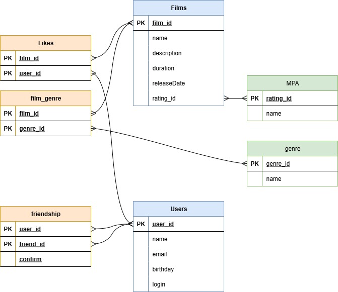

# java-filmorate

<h3>Film</h3>
Жанры и рейтинг вынесены в отдельные сущности.
Таблица <b>likes</b> является связующей с составным ключом.

Основная информация о фильмах:
<pre>
SELECT *
FROM films
LEFT JOIN MPA ON films.rating_id = MPA.rating_id
</pre>

Поиск жанров относящихся к фильму:
<pre>
SELECT genre.name
FROM film_genre
LEFT JOIN films ON films.film_id = film_genre.film_id
LEFT JOIN genre ON film_genre.genre_id = genre.genre_id
WHERE films.film_id = ...
</pre>

Количество лайков фильма:
<pre>
SELECT COUNT(user_id)
FROM likes
LEFT JOIN films ON likes.film_id = films.film_id
WHERE films.film_id = ...
Group by films.name
</pre>

<h3>User</h3>
Состояние дружбы вынесено в отдельную сущность.
Таблица <b>friendship</b> функционирует опираясь на составной первичный ключ (уникальная комбинация id двух пользователей) и состояния (boolean).

Получить список друзей пользователя:
<pre>
SELECT u2.name
FROM friendship
LEFT JOIN users u1 ON friendship.user_id = users.user_id 
LEFT JOIN users u2 ON friendship.friend_id = users.user_id
WHERE user_id = ... AND confirm = true
</pre>