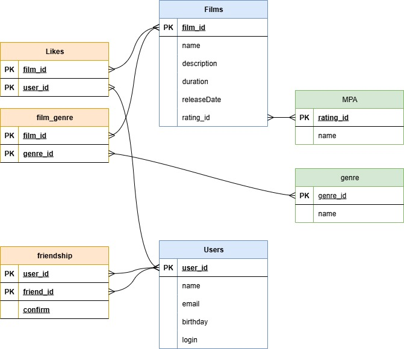

# 🎬 Filmorate
Filmorate — это backend-приложение для работы с каталогом фильмов и пользовательскими рейтингами.
Сервис позволяет пользователям взаимодействовать друг с другом и получать рекомендации фильмов на основе предпочтений.

Проект реализован как REST API без пользовательского интерфейса.

## 🚀 Функциональность
### 👤 Пользователи
* создание, обновление и удаление пользователей
* добавление и удаление друзей
* получение списка друзей
* поиск общих друзей
### 🎥 Фильмы
* добавление, обновление и удаление фильмов
* получение списка всех фильмов
* получение фильма по id
### ❤️ Лайки и популярность
* добавление и удаление лайков фильмам
* получение списка самых популярных фильмов
### 🤝 Социальные функции
* просмотр общих фильмов с друзьями
* взаимодействие между пользователями
### ⭐ Рекомендации
* простая рекомендательная система на основе лайков пользователей

## 🛠 Технологии и стек проекта
### 🚀 Backend

* Spring Boot 3.2
* Spring Web (Spring MVC)
* Spring JDBC
  
### 🗄️ База данных

* H2 Database

### ✅ Валидация и обработка данных

* Jakarta Bean Validation

### 🧪 Тестирование

* Spring Boot Test
* JUnit 5
* Mockito

### 🪵 Логирование

* Logbook

### ⚙️ Инструменты и сборка

* Java 21
* Maven
* Lombok
* Checkstyle

## 🏗 Архитектура

Проект построен по слоистой архитектуре:

Controller — обработка HTTP-запросов

Service — бизнес-логика

Storage (DAO) — работа с базой данных

## ⚙️ Запуск проекта

### 1. Клонировать репозиторий
git clone https://github.com/DarinaLeonoff/Filmorate.git 

cd Filmorate

### 2. Настроить окружение
* JDK 11+
* Maven

### 3. Запустить
./mvnw spring-boot:run

## 📡 API
Примеры эндпоинтов:
### Пользователи
* GET /users - получение списка пользователей
* POST /users - добавление нового пользователя
* PUT /users - обновление данных пользователя
* DELETE /users/{id} - удаление пользователя
* GET /users/{id} - получение данных конкретного пользователя
### Дружба
* GET /users/{id}/friends/{friendId} - добавление пользователя с id = friendId в друзья
* DELETE /users/{id}/friends/{friendId} - удаление пользователя с id = friendId из друзей
* GET /users/{id}/friends - получение списка друзей пользователя
* GET /users/{id}/friends/common/{friendId} - получение списка общих друзей
### Фильмы
* GET /films - получение полного списка фильмов отсортированных по убыванию популярности
* POST /films - добавление новых фильмов
* PUT /films - обновление данных фильма
* DELETE /films/{id} - удаление фильма
* GET /films/{id} - получение данных конкретного фильма
### Лайки
* PUT /films/{id}/like/{userId} - поставить фильму лайк
* DELETE /films/{id}/like/{userId} - убрать лайк
* GET /films/{filmId}/likes - получить список id лайкнувших фильм
### Топ
* GET /films/popular?count={n} - вывод топ-n фильмов по количеству лайков (по-умолчанию 10)

## 🗄 Работа с БД
- используется H2 Database
- нормализованная структура (films, users, likes, friendship)
- связи многие-ко-многим реализованы через промежуточные таблицы

Примеры запросов
 
<h3>Film</h3>
Жанры и рейтинг вынесены в отдельные сущности.
Таблица <b>likes</b> является связующей с составным ключом.

Основная информация о фильмах:
<pre>
SELECT *
FROM films
LEFT JOIN MPA ON films.rating_id = MPA.rating_id
</pre>

Поиск жанров относящихся к фильму:
<pre>
SELECT genre.name
FROM film_genre
LEFT JOIN films ON films.film_id = film_genre.film_id
LEFT JOIN genre ON film_genre.genre_id = genre.genre_id
WHERE films.film_id = ...
</pre>

Количество лайков фильма:
<pre>
SELECT COUNT(user_id)
FROM likes
LEFT JOIN films ON likes.film_id = films.film_id
WHERE films.film_id = ...
Group by films.name
</pre>

<h3>User</h3>
Состояние дружбы вынесено в отдельную сущность.
Таблица <b>friendship</b> функционирует опираясь на составной первичный ключ (уникальная комбинация id двух пользователей) и состояния (boolean).

Получить список друзей пользователя:
<pre>
SELECT u2.name
FROM friendship
LEFT JOIN users u1 ON friendship.user_id = users.user_id 
LEFT JOIN users u2 ON friendship.friend_id = users.user_id
WHERE user_id = ... AND confirm = true
</pre>

## 📚 Чему я научилась
1. Выстраивать взаимодействие с in-memory db в application.properties.
2. Отлавливать ошибки глобально и стандартизировать их.
3. Выстраивать архитектуру взаимодействия основных элементов (пользователи и фильмы) и дополнительных (в текущем проекте - жанры, рейтинг, лайки, дружба).
4. Задавать исходные данные через data.sql и data.sql.
6. Проектированию слоистой архитектуры приложения.
7. Работе с базой данных через JDBC.
8. Реализации бизнес-логики (лайки, друзья, рекомендации).
